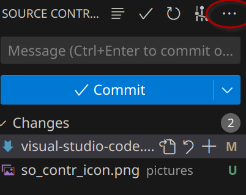
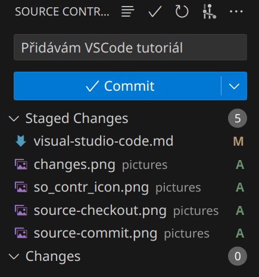
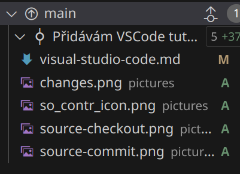

## Stáhnutí repozitáře
Prvni si kliknete na source control (Ctrl+Shift+G)

Potom by se vám mělo zobrazit tlačítko clone repository
Odtud by to po vás mělo chtít přihlášení přes github
Potom co toto provedete tak by měla ve vscode vyběhnout nabídka repositářů, které si můžete naklonovat.
Pokud se zde neukáže FAV-SPOT, tak zajděte na github a zkopírujte si url
Tu už to najde a máte repozitář stažený

## Checkout na vlastní branch
Když už máte naklonováno, tak máte naklonovaný main. V tom prosím neprovádějte změny.
Aby jste se dostali na vlastní branch tak jděte opět do source control.

V nabídce co vyskočí následně vyberte možnost "Checkout to.." a tam vyberte svojí branch.

Tohle je obecný způsob jak přehazovat branche.

## Pull/Push
Aby jste měli aktuální údaje o svých datech, tak je potřeba nejdřív data stáchnout, a potom poslat. (Pull/Push)

Toto opět najdete v záložce source control. Když otevřete repozitář, tak by mělo být možné kliknout velké  modré tlačítko a váš adresář by měl být up-to-date.

Když potom máte všechno hotové a vlezete do source control, uvidíte něco podobného jako na obrázku.

U každého soubboru je možnost stisknout znak "+". Tím přidáte změny do "commitu".
Potom napíšete nějakou blbost to místa nad tlačítkem commit

Ted' stisknete commit a buď se talčítko změní na Push changes nebo se vám objeví něco takového:

Tady je vedle názvu branch vidět čára s tečkou a šipkou nahoru. Tu stiskněte a změny se projeví na GitHubu